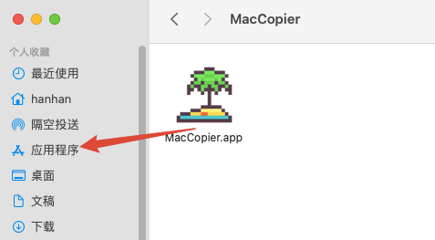
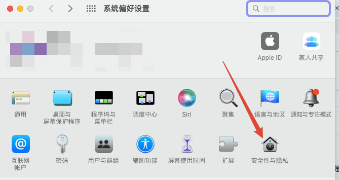
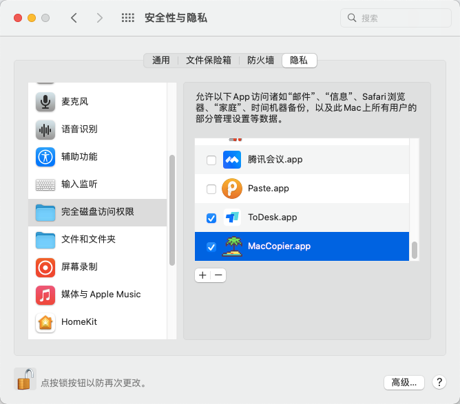
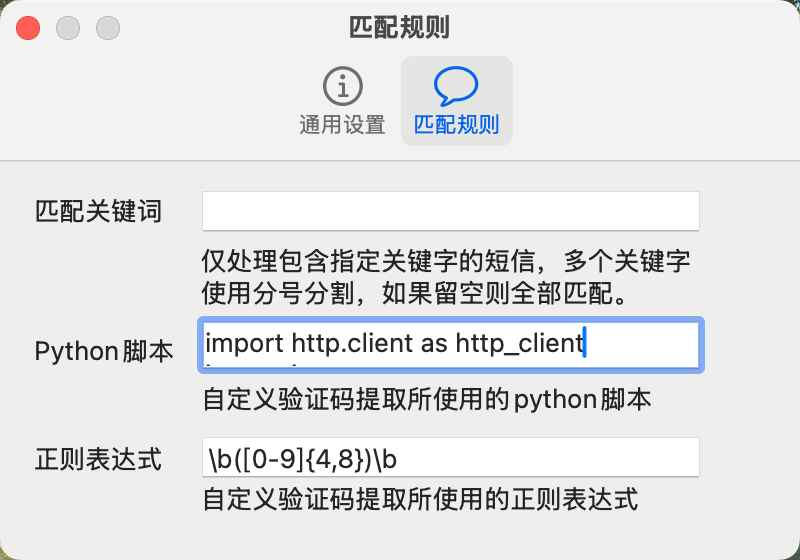

<p align="center">
    <a href="https://github.com/DreamSaddle/MacCopier/releases">
    
    </a>
    <a href="https://github.com/DreamSaddle/MacCopier/commits/main">
    
    </a>
    <a href="https://github.com/DreamSaddle/MacCopier/issues">
    
    </a>
    <a href="https://github.com/DreamSaddle/MacCopier/blob/master/LICENSE">
    
    </a>
</p>

# MacCopier

MacCopier(Message Authentication Code Copier) 是一个提供在 Macos 中收到短信验证码后自动复制到剪贴板功能的软件。

> **Warning**
>
> 请务必从[这里下载](https://github.com/DreamSaddle/MacCopier/releases)，此应用目前没有提供其它下载链接，以防止造成您的数据泄露。

## 功能列表

- [x] 收到验证码短信后自动提取验证码到到剪贴板
- [x] 自动粘贴到当前光标处
- [x] 自定义验证码提取 Python 脚本

## 隐私信息收集

此应用为开源项目。应用通过不断扫描 `~/Library/Messages/chat.db` 数据库文件获取最新的短信验证码，**期间不会上传系统中任何数据**。

## 安装

1. [点击下载](https://github.com/DreamSaddle/MacCopier/releases)
2. 解压后，将 MacCopier.app 拖动到 应用程序 目录即可



## 使用

### 让您的 Mac 能接收短信息

参照[教程](https://support.apple.com/zh-cn/guide/messages/icht8a28bb9a/mac)将 iPhone 开启**短信转发**功能。

### 设置应用权限

安装好软件后，需要为其设置 **完全磁盘访问权限**。步骤如下：

1. 打开 系统偏好设置 > 安全性与隐私
   

2. 左下角解锁设置后，找到 完全磁盘访问权限 选项，在右侧列表中找到 MacCopier 将其勾选上即可。
   

3. 您也可以在高级设置中勾选 `登录时启动`，这将会在下次登录系统时自动运行此应用。

4. 您也可以勾选 `自动粘贴`，这将会在提取出验证码后自动粘贴到系统当前光标处。`自动粘贴`功能需要您为 `MacCopier`开启`辅助功能`权限。

## 自定义验证码提取 Python 脚本

应用默认采用正则表达式进行匹配，但是正则表达式在提取某些特殊的验证码时存在不符合预期的情况。

所以，现增加自定义 Python 脚本提取验证码的功能。有了此功能，用户可以自定义提取逻辑，比如将短信发送给本地大模型进行处理，这样将会大幅提高提取的准确度。

### 使用方式

你可以在高级设置中进行脚本设置。


#### 说明

应用接收到新的短信后，如果用户自定义了 Python 脚本，将会将短信内容作为参数执行脚本。Python 脚本执行使用的 Python 可执行文件路径为`/usr/bin/python3`

```text
执行脚本输入：完整的短信内容

执行脚本输出：

1. 如果短信是验证码短信，且脚本执行正常，则返回验证码。
2. 如果短信不是验证码短信，则返回 `NOT_VALID`。
3. 如果 Python 脚本执行错误，则返回 `ERROR`，MacCopier 将继续采用正则表达式提取。
```

#### 示例

下面是我使用的脚本，我在本地安装了 [ollama](https://ollama.com/)，并且使用了 [qwen2.5:3b](https://ollama.com/library/qwen2.5:3b) 模型，自定义 Python 脚本将短信送给本地大模型处理。

```python
import http.client as http_client
import json
import sys


def extract_code(msg):
    # 定义 prompt
    prompt = """
                您是一位智能信息提取助手。您的任务是从给定的短信中提取验证码。
                您应该以 JSON 格式回复,格式如下:
                {"code": "验证码内容"}

                注意事项:
                1. 返回格式中的\"验证码内容\"就是具体的验证码内容，可能是由数字+字母等其他字符组成。
                2. 如果我给你的不是包含验证码的短信，请你直接以json格式返回 {"code":"NOT_VALID"}
                3. 直接返回json格式，不要以markdown格式返回内容

                下面是我收到的短信内容：
                """ + msg

    # 调用 ollama 本地大模型处理
    conn = http_client.HTTPConnection('127.0.0.1:11434', timeout=5)
    try:
        conn.request('POST', '/api/generate', body=json.dumps({
            'prompt': prompt,
            'model': 'qwen2.5:3b',
            'stream': False
        }), headers={
            "Content-Type": "application/json",
            "Accept": "application/json"
        })
        rep = conn.getresponse()
        rep_data = rep.read().decode('utf-8')
        rep_str = json.loads(rep_data)['response']
        code_rep = json.loads(rep_str)
        return code_rep['code']
    except Exception as e:
        return 'ERROR'
    finally:
        conn.close()


if __name__ == "__main__":
    # 接收第一个参数为短信内容
    msg = sys.argv[1]
    # 打印输出结果
    print(extract_code(msg))
```

## 项目依赖

- [LaunchAtLogin](https://github.com/sindresorhus/LaunchAtLogin) 提供登录时启动功能
- [Sauce](https://github.com/Clipy/Sauce) 提供自动粘贴功能

## 其它

- 扫描短信数据库文件 SQL 来自 [py2fa](https://github.com/TeavenX/py2fa/blob/7cf6514e9d0344b0b2789e2a2eb73bdf5bb1df8b/message2fa.py#L42)。
